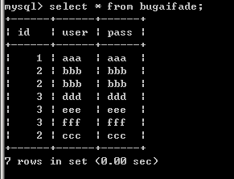
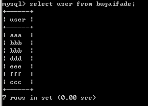

# group by解释  
有这样一个表，如下  
  
直接执行
```
select id,user from bugaifade group by id;
```
结果会报错，如下图  
  
原因是group by的使用需要对其他字段进行处理，如下图是正确使用方式  
  
同理，将函数count()换成group_concat()即为group_concat()用法，如下图  
  

# group_concat()解释
group_concat()还可用在如下情况中，当从表的一个字段中选出所有值时  
  
可使用group_concat()将多行值连接为一行（需要注意group_concat是有长度限制的，最长为1024）  


# 补充
MySQL >= 5.7.22可使用json_arrayagg()代替group_concat()，见下图  


参考链接：  
https://www.runoob.com/mysql/mysql-group-by-statement.html  
https://www.w3schools.com/sql/func_mysql_count.asp  
https://www.w3schools.com/sql/sql_groupby.asp  
https://www.w3resource.com/mysql/aggregate-functions-and-grouping/aggregate-functions-and-grouping-group_concat.php  
https://segmentfault.com/a/1190000004844113
